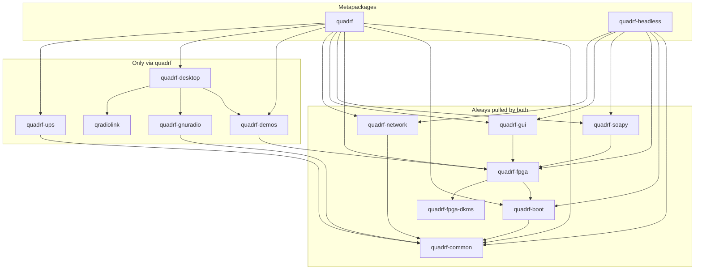

## Installing

On a Raspberry Pi 5 running [DietPi](https://dietpi.com/):

The Pi needs network access and `sudo`. Installer assumes default account: `dietpi`.

Packages are published by GitHub Actions to the signed apt repository on GitHub Pages.

```bash
# trust key + add repo
sudo install -d -m 0755 /etc/apt/keyrings
curl -fsSL https://scalerf.github.io/QuadRF/quadrf.gpg \
  | sudo tee /etc/apt/keyrings/quadrf.gpg >/dev/null
echo "deb [signed-by=/etc/apt/keyrings/quadrf.gpg] https://scalerf.github.io/QuadRF trixie main" \
  | sudo tee /etc/apt/sources.list.d/quadrf.list >/dev/null

# install
sudo apt update
sudo apt install quadrf          # complete appliance
# sudo apt install quadrf-headless # radio, network and web GUI, no desktop

# required once after install
# `quadrf-boot` updates `config.txt` and the device-tree overlays, taking effect after a reboot
sudo reboot
```

After reboot:

```bash
quadrf status
```

Lists services, CSI/DSI drivers, SoapySDR devices and interface addresses. The
web UI is at [http://quadrf.local/](http://quadrf.local/).

See [install/README.md](../install/README.md) for the package list and
[packaging/README.md](../packaging/README.md) for how releases are built.


## Packages




## Configure

Site settings live in `/etc/quadrf/quadrf.conf`:


| Setting             | Default          | Effect                                         |
| ------------------- | ---------------- | ---------------------------------------------- |
| `QUADRF_USER`       | `dietpi`         | Account for the desktop, web GUI and demos     |
| `QUADRF_BOOT_DIR`   | `/boot/firmware` | Firmware partition (`config.txt`, `overlays/`) |
| `QUADRF_TLS_DOMAIN` | `my.quadrf.com`  | CN on the per-unit self-signed cert            |
| `QUADRF_HOSTNAME`   | `quadrf`         | mDNS / nginx name (`HOSTNAME.local`; desktop is `HOSTNAMEd.local` and `HOSTNAME-desktop.local`) |
| `QUADRF_AP_SSID`    | `QuadRF`         | Fallback access point SSID                     |
| `QUADRF_AP_PASS`    | empty            | Fallback AP WPA2 passphrase; empty = open      |
| `QUADRF_AP_ADDRESS` | `192.168.44.1`   | Pi address in access point mode                |
| `QUADRF_OPENOCD`    | empty            | Override OpenOCD; used to program the FPGA with BYO bitstream     |


After editing:

```bash
sudo quadrf apply
```

This re-runs the package config hooks under `/usr/lib/quadrf/apply.d/`
(firmware block, service account drop-ins, generated nginx/dnsmasq/hostapd/
sudoers, desktop layout).

Several QuadRFs on one LAN share the default mDNS name `quadrf.local`. Avahi
then renames one unit to `quadrf-2.local`. Set a distinct `QUADRF_HOSTNAME` on
each unit and re-run `sudo quadrf apply` if you need stable names.

## Upgrade

```bash
sudo apt update && sudo apt upgrade
```

Changed packages are download; services restart as needed. A kernel upgrade
rebuilds the CSI/DSI drivers via DKMS if matching `linux-headers` are installed.

## Remove

```bash
sudo apt remove 'quadrf-*'               # all packages
sudo apt purge 'quadrf-*'                # and configuration
```

Removing `quadrf-boot` strips the QuadRF block from `config.txt` and the
overlays; reboot afterward.

## Troubleshooting


| Symptom                                         | Check                                                                                                                              |
| ----------------------------------------------- | ---------------------------------------------------------------------------------------------------------------------------------- |
| `load-quadrf.service` fails                     | Overlays need a reboot. Confirm the QuadRF block in `/boot/firmware/config.txt` and that `quadrf status` shows the drivers loaded. |
| Drivers missing after a kernel upgrade          | `dkms status`. `quadrf-fpga-dkms` depends on `linux-headers-rpi-2712` (Pi 5) or `linux-headers-rpi-v8`. Then `sudo dkms autoinstall`. |
| `quadrf.local` does not resolve                 | Check `systemctl status avahi-daemon` and that the client supports mDNS.                                                           |
| `quadrf-soapy-server` bind fails / restart loop | Stock `soapyremote-server` must stay masked; `quadrf-soapy` owns port 55132.                                                       |
| No fallback access point                        | Default SSID `QuadRF` is open unless `QUADRF_AP_PASS` is set. `hostapd` must be active (`journalctl -u hostapd`). Trixie skips the unit unless `/etc/hostapd/quadrf.conf` satisfies the condition drop-in. |
| `networking.service` / `misplaced option`       | Comment leftover `wireless-power` / `wpa-conf` lines in `/etc/network/interfaces`. |
| apt/HTTPS fails while the AP is up              | Remove `address=/#/` from `/etc/dnsmasq.d/quadrf-wlan0-ap.conf` and `systemctl reload dnsmasq`. |
| USB `10.55.0.1` listed but unreachable          | The gadget address is configured even with no carrier. Plug the Pi USB-C data port into a host so `usb0` gets a link.              |
| Laptop on ethernet has only IPv6                | `quadrf-ethernet` follows carrier: ~12s with no DHCP then `10.55.1.1`. A leftover router lease is dropped if that gateway is gone. |
| nginx will not start                            | `nginx -t`. Site is generated at `/etc/nginx/sites-available/quadrf`; regenerate with `sudo quadrf apply`.                         |
| QuadRF services show `disabled`                 | Packages enable them on install. On a unit that predates this tree: `sudo systemctl enable --now load-quadrf quadrf-gui quadrf-hotspot quadrf-ethernet quadrf-desktop quadrf-ups quadrf-soapy-server`. |


Service logs: `journalctl -u load-quadrf -u quadrf-gui -b`.