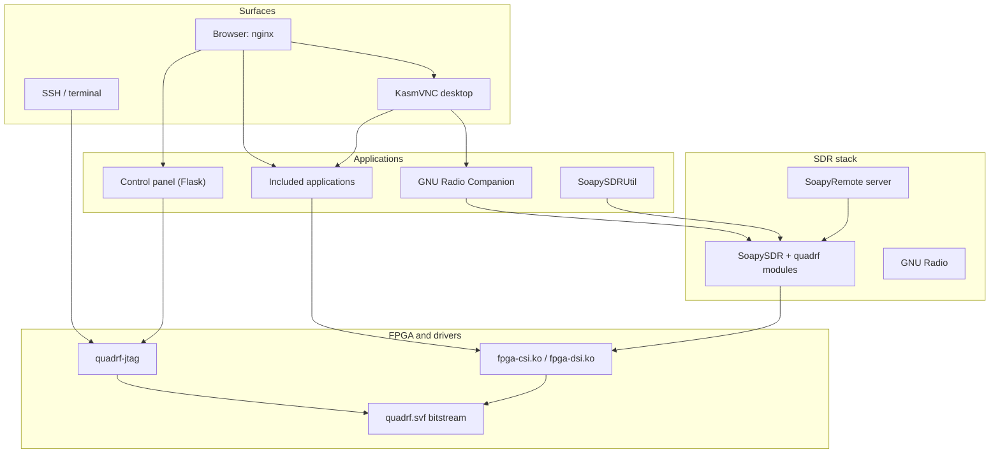
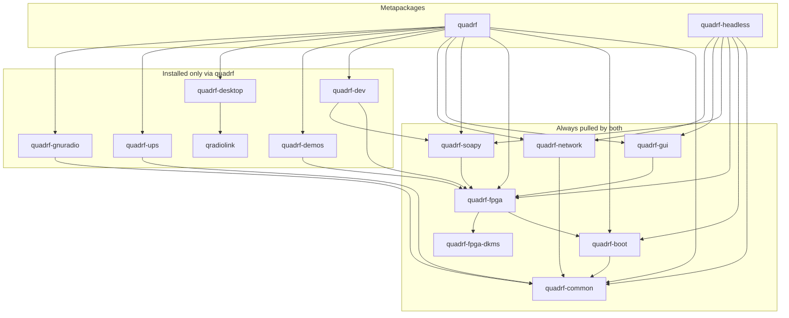

# Overview

QuadRF is a modular 4x4 MIMO software-defined radio tile powered by an integrated Raspberry Pi 5 running DietPi. The software stack integrates low-level FPGA bitstream programming, Linux kernel DMA drivers, SoapySDR interfaces, a web-based management GUI, and a remote desktop.

---

## 1. System Architecture



| Layer | Responsibility | Primary Packages |
| --- | --- | --- |
| **FPGA & Drivers** | Programs ECP5 bitstream, loads CSI (RX) and DSI (TX) kernel modules, initialises front-end transceivers | `quadrf-fpga`, `quadrf-fpga-dkms`, `quadrf-boot` |
| **SDR Stack** | Presents 4x4 MIMO channels via SoapySDR (`driver=mipi`) locally and over network | `quadrf-soapy` |
| **User Surfaces** | Web control panel, KasmVNC remote desktop, SSH terminal | `quadrf-gui`, `quadrf-desktop`, `quadrf-network` |

---

## 2. Package Architecture

QuadRF provides two top-level metapackages:
- `quadrf`: Full appliance installation with remote desktop, graphical apps, GNU Radio, demo sources, and development headers.
- `quadrf-headless`: Minimal installation containing drivers, SoapySDR modules, web control panel, and network services without X11 or desktop software.



| Package | Contents |
| --- | --- |
| `quadrf-common` | Master configuration `/etc/quadrf/quadrf.conf`, shared helpers, and the `quadrf` command |
| `quadrf-boot` | Device tree overlays (`fpga-csi.dtbo`, `fpga-dsi.dtbo`) and `/boot/firmware/config.txt` management |
| `quadrf-fpga` | Lattice ECP5 bitstream (`quadrf.svf`), `quadrf-jtag` CLI, and `load-quadrf.service` |
| `quadrf-fpga-dkms` | Kernel modules (`fpga-csi.ko`, `fpga-dsi.ko`) built for the host kernel by DKMS |
| `quadrf-soapy` | SoapySDR hardware driver module (`libmipi.so`) and dedicated SoapyRemote service |
| `quadrf-gui` | Flask control panel served on port 8080 |
| `quadrf-network` | Nginx reverse proxy, dnsmasq DHCP/DNS, mDNS responder, and Wi-Fi mode management |
| `quadrf-dev` | C++ headers (`fpga_csi.h`, `Farrow.hpp`), CMake configuration, and source trees under `/usr/src/` |
| `quadrf-demos` | Reference apps (Spatial RF Vision, PSD Plot, NTSC decoder, Near-Field Phasors) and source examples |
| `quadrf-desktop` | KasmVNC desktop environment (`DISPLAY=:1`) with desktop launchers and triggers |
| `quadrf-gnuradio` | Example GNU Radio Companion flowgraphs |
| `quadrf-ups` | Hardware battery monitor integration for the UPS HAT |

---

## 3. Network Interfaces & Access

QuadRF configures multiple network paths simultaneously:

| Context | Address | Notes |
| --- | --- | --- |
| **Local LAN** | `quadrf.local` | Multicast DNS (mDNS) responder advertises on all active interfaces. First-time setup uses HTTP; operational controls use HTTPS. |
| **Ethernet Direct** | `10.55.1.1` | Point-to-point link. When connected directly to a computer without an upstream DHCP router, dnsmasq issues an IP lease to the PC after ~12s. |
| **USB Gadget** | `10.55.0.1` | Operates over the Raspberry Pi 5 USB-C data port via `g_ether`. Power the Pi separately to avoid host USB brownouts. |
| **Fallback Wi-Fi AP** | `192.168.44.1` | SSID `QuadRF` (open by default). Activates automatically on first boot or when saved Wi-Fi networks are unreachable. |

### Multi-Unit LAN Negotiation

When multiple QuadRF units operate on the same LAN:
- The first unit claims `quadrf.local`.
- Subsequent units automatically increment to `quadrf-2.local`, `quadrf-3.local`, etc.
- In the web UI under **Network Setup**, you can assign a custom hostname. Enabling **Don't yield this name** prevents the unit from falling back to an incremented suffix if a conflict occurs.

### Web Entry Points

Nginx handles ingress on ports 80 (HTTP) and 443 (HTTPS):

| Path / Domain | Function | Backend Service |
| --- | --- | --- |
| `/` | Appliance Web Control Panel | Flask on port 8080 |
| `quadrfd.local`, `quadrf-desktop.local`, or `:6080` | Operator Remote Desktop | KasmVNC on port 8444 |
| `quadrfd.local/split` | Dual view: desktop + control panel | Kasm iframe + Flask |
| `/AR/` | Mobile Augmented Reality view | Static assets in `/usr/share/quadrf/ar/` |
| `/ws` | High-rate RF vision data stream | `quadrf-rf-vision` on port 8000 |
| `/setup/security/` | Platform root certificate installation | Local root CA certificate distribution |

> For certificate installation and browser HTTPS configuration, see [HTTPS Setup](tls.md).

---

## 4. Service Chain & Execution Order

QuadRF uses systemd units with hardware and network dependencies:

```text
load-quadrf.service          OpenOCD -> bitstream -> drivers -> quadrf-jtag --init
        │
quadrf-gui.service           Web control panel on port 8080
quadrf-soapy-server.service  SoapyRemote server on port 55132
        │
nginx.service                Reverse proxy for /, :6080, /AR/, /ws
quadrf-desktop.service       KasmVNC session on port 8444
quadrf-ups.service           UPS HAT battery telemetry
quadrf-hotspot.service       Wi-Fi client/hotspot controller
quadrf-ethernet.service      Ethernet link manager (DHCP client or 10.55.1.1 static)
quadrf-usb.service           USB gadget network link on 10.55.0.1
```

If the RF board is unattached or fails FPGA programming, `load-quadrf.service` reports a failure, but web management, networking, and remote desktop services remain operational.

---

## 5. Appliance Configuration (`quadrf.conf`)

Configuration settings are stored in `/etc/quadrf/quadrf.conf`:

| Parameter | Default | Description |
| --- | --- | --- |
| `QUADRF_USER` | `dietpi` | User account running desktop, GUI, and user apps |
| `QUADRF_BOOT_DIR` | `/boot/firmware` | Boot partition path for `config.txt` and overlays |
| `QUADRF_HOSTNAME` | `quadrf` | Base system hostname and mDNS name |
| `QUADRF_AP_SSID` | `QuadRF` | Fallback Wi-Fi access point SSID |
| `QUADRF_AP_PASS` | *(empty)* | Fallback access point WPA2 password (empty = open) |
| `QUADRF_AP_ADDRESS` | `192.168.44.1` | Static IP address for the Wi-Fi hotspot |
| `QUADRF_WIFI_MODE` | `sta` | Operating Wi-Fi mode: `sta` (client), `ap` (hotspot), or `off` |
| `QUADRF_WIFI_FALLBACK` | `yes` | Automatically enable AP mode if Wi-Fi client fails |
| `QUADRF_OPENOCD` | *(empty)* | Custom OpenOCD path for programming external bitstreams |

### Applying Configuration Changes

Whenever `/etc/quadrf/quadrf.conf` is updated, apply changes across all services:

```bash
sudo quadrf apply
```

This executes hook scripts in `/usr/lib/quadrf/apply.d/` to regenerate configuration files for nginx, dnsmasq, hostapd, sudoers, and boot overlays.

---

## 6. Filesystem Paths

| Path | Description |
| --- | --- |
| `/etc/quadrf/quadrf.conf` | Appliance configuration file |
| `/usr/bin/quadrf` | Appliance administrative CLI (`status`, `apply`) |
| `/usr/bin/quadrf-app` | Application lifecycle controller (`status`, `start`, `stop`, `register`, `unregister`) |
| `/usr/bin/quadrf-jtag` | Hardware transceiver control utility |
| `/usr/share/quadrf/` | Static web assets, bitstream files, OpenOCD scripts, and GNU Radio flowgraphs |
| `/usr/share/quadrf/examples/` | Standalone example code and Makefile |
| `/usr/src/quadrf-fpga-*/` | CSI and DSI kernel driver source trees |
| `/usr/src/quadrf-jtag/` | Standalone source tree for `quadrf-jtag` |
| `/usr/src/quadrf-soapy/` | Standalone source tree for SoapySDR modules |
| `/usr/lib/quadrf/apply.d/` | Configuration update hooks executed by `quadrf apply` |
| `/var/lib/quadrf/` | Persistent runtime state and boot records |

---

## 7. Software Maintenance

### System Upgrades

Keep the system and QuadRF software stack up to date using `apt`:

```bash
sudo apt update && sudo apt upgrade
```

When new Linux kernels are installed, DKMS automatically rebuilds `fpga-csi` and `fpga-dsi` drivers if matching `linux-headers` are present.

### Uninstallation

To completely remove QuadRF packages and configuration:

```bash
sudo apt purge 'quadrf-*'
```

Removing `quadrf-boot` automatically cleans up device tree overlay entries from `/boot/firmware/config.txt`. Force reboot afterward:

```bash
sudo systemctl reboot --force
```

For diagnosing issues, see [Troubleshooting](troubleshooting.md).
