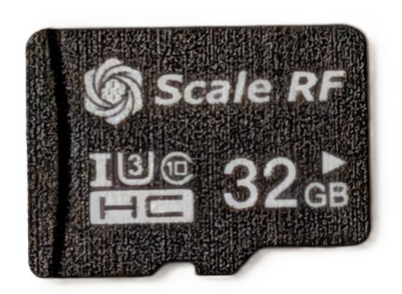

The [QuadRF Kit](https://www.crowdsupply.com/scale-rf/quadrf#) ships with a microSD card with all software pre-installed. But if you want to start fresh or build your own image containing the latest QuadRF software, this is your guide!<br clear="all">

### What you need
- the QuadRF Kit, of course  _(with its built-in Raspberry Pi 5)_
- a 16 GB or larger microSD card _(e.g., or the 32 GB one that came with your QuadRF Kit)_
- a microSD card writer


### Building the DietPi base image

- First download the **Raspberry Pi Imager** program here: https://www.raspberrypi.com/software/
- Also download the base **DietPi Trixie** image: https://dietpi.com/downloads/images/DietPi_RPi5-ARMv8-Trixie.img.xz

Run the Raspberry Pi Imager: <br/>
1. Select Raspberry Pi 5. <br/>
2. Scroll to the bottom: **Custom Image**. <br/>
    (Pick the DietPi Trixie image you downloaded) <br/>
3. Write to your microSD Card. <br/>

### Get the Pi connected to the internet.

To install the QuadRF-specific software on top of your fresh DietPi image, you need to get your Pi 5 on the internet!
An easy approach is to edit the configuration files on the microSD card before you move it to the Pi 5 for first boot.

#### To add your Wi-Fi network
In **dietpi.txt**: <br/>
`AUTO_SETUP_NET_WIFI_ENABLED=1`

In **dietpi-wifi.txt**: <br/>
`aWIFI_SSID[0]='[your ssid]'`<br/>
`aWIFI_KEY[0]='[your password]'`

(save, and remember to safely eject the microSD card before moving to the Pi 5).

### Connect to Pi 5 via SSH

Pop your fresh DietPi image into the QuadRF Raspberry Pi 5 using the rear slot. Plug in the USB-C power or turn on your Mobile Battery Pack switch. Then let it boot!

After 30 seconds or so you should be able to connect via SSH (if you don't have Linux or macOS, you can use tools like [Putty](https://www.chiark.greenend.org.uk/~sgtatham/putty/latest.html) for Windows).

The hostname is typically `DietPi` or `DietPi.local` (may be case-sensitive!), but if those don't work you may need to connect to the IP address assigned by your router. You can also just plug in a Micro-HDMI cable and a USB keyboard directly.<br/>
The default username (if you didn't change it in the config earlier) is,<br/>
Username: `root`<br/>
Password: `dietpi`<br/>

At first boot, you will be prompted to update passwords and install software. You can safely skip installing any extra software if you want a minimal build.

## Install the QuadRF Builder!

Once you're logged into your QuadRF Pi 5 using SSH (or a keyboard and monitor), simply run (as root): <br/>
```bash
# trust key + add repo
sudo install -d -m 0755 /etc/apt/keyrings
curl -fsSL https://scalerf.github.io/QuadRF/quadrf.gpg \
  | sudo tee /etc/apt/keyrings/quadrf.gpg >/dev/null
echo "deb [signed-by=/etc/apt/keyrings/quadrf.gpg] https://scalerf.github.io/QuadRF trixie main" \
  | sudo tee /etc/apt/sources.list.d/quadrf.list >/dev/null

# install
sudo apt update
sudo apt install quadrf

# required once after install
sudo reboot  # `quadrf-boot` updates `config.txt` and the device-tree overlays, taking effect after a reboot
```

After reboot you can check `quadrf status` for more about services, CSI/DSI drivers, SoapySDR devices and interface addresses.

### That's it!
You should now have an up-to-date QuadRF microSD image and can get started on the many applications! <br/> Check out https://scalerf.com/docs/ for more information.

The web UI is at `http://quadrf.local`

Details: [docs/install.md](../docs/install.md).


## Packages

Install metapackages `quadrf` or `quadrf-headless`, or pick components. [docs/install.md](../docs/install.md#packages).

| Package            | Contents                                                                                                                                                  |
| ------------------ | --------------------------------------------------------------------------------------------------------------------------------------------------------- |
| `quadrf`           | **Metapackage**: boot, common, fpga, soapy, gui, network, demos, desktop, gnuradio, ups; recommends mesh (`quadrf-phy`, `quadrf-meshtasticd`) |
| `quadrf-headless`  | **Metapackage**: boot, common, fpga, soapy, gui, network; recommends mesh (`quadrf-phy`, `quadrf-meshtasticd`)                                            |
| `quadrf-common`    | `/etc/quadrf/quadrf.conf`, shared helpers, the `quadrf` command                                                                                           |
| `quadrf-boot`      | Device-tree overlays, firmware configuration                                                                                                              |
| `quadrf-fpga`      | Bitstream, `quadrf-jtag`, `load-quadrf.service`                                                                                                           |
| `quadrf-fpga-dkms` | CSI and DSI kernel drivers, built by DKMS                                                                                                                 |
| `quadrf-soapy`     | `mipi` and `quadrf` SoapySDR modules, SoapyRemote service                                                                                                 |
| `quadrf-gui`       | Flask control panel on port 8080                                                                                                                          |
| `quadrf-network`   | nginx, dnsmasq, mDNS, access point                                                                                                                        |
| `quadrf-demos`     | Spatial RF Vision, PSD plot, NTSC decoder (`mpv`), AR                                                                                                     |
| `quadrf-desktop`   | KasmVNC session with QuadRF launchers                                                                                                                 |
| `quadrf-gnuradio`  | Example flowgraphs                                                                                                                                        |
| `quadrf-ups`       | UPS HAT battery monitor                                                                                                                                   |

## Dependencies

SoapySDR, GNU Radio, gr-osmosdr, nginx, dnsmasq, hostapd, mpv and others are from
Debian. <br/> The following others are mirrored or rebuilt into the QuadRF
repository with versions pinned in `packaging/pins.env`:

- `quadrf-openocd`, the Raspberry Pi OpenOCD fork with RP1 GPIO support
- `kasmvncserver`, the upstream KasmVNC release
- `qradiolink`, the SDR transceiver used by the KasmVNC desktop launcher
- `quadrf-phy` / `quadrf-meshtasticd`, built from the separate
[quadrf-mesh](https://github.com/radioroy/quadrf-mesh) repo — the LoRa
PHY and a patched `meshtasticd` that runs the Meshtastic protocol over
it. `Recommends:` on `quadrf` / `quadrf-headless`, so a plain
`apt install quadrf` carries mesh support when those packages are in the
apt repository; drop them with `--no-install-recommends`.

## Additional Setup Documentation

| Doc                                              | Contents                            |
| ------------------------------------------------ | ----------------------------------- |
| [docs/overview.md](../docs/overview.md)          | Overview                            |
| [docs/install.md](../docs/install.md)            | Install, configure, upgrade, remove |
| [docs/certbot.md](../docs/certbot.md)            | TLS certificates                    |
| [packaging/README.md](../packaging/README.md)    | Building and publishing packages    |
| [GitHub Releases](https://github.com/ScaleRF/QuadRF/releases) | Package release notes |
| [TODO.md](../TODO.md)                            | TODO                                |
